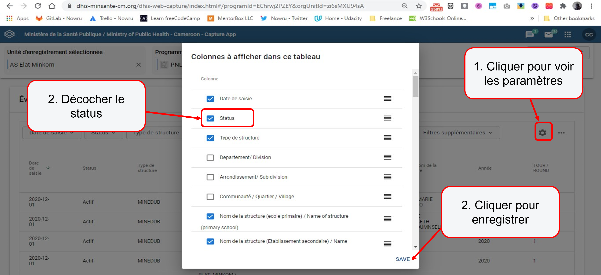

# Comment accéder au logiciel DHIS2 ? {.custom-slide}

## Comment accéder au logiciel DHIS2 de SHWARI? {.info-slide}

> - Le DHIS2 est un logiciel pour la collecte, l’analyse et le partage des données.  
> - Pour accéder au logiciel, il est indispensable de disposer d’un ordinateur, d’une tablette ou d’un téléphone Android connecté à internet  
> - L’adresse web du DHIS2 du SHWARI est <http://dhis2.org>
> - Pour accéder aux formulaires de saisie Event ou Tracker, les M&E Mentors utilisent leur compte DHIS2.

# Quelles sont les étapes à suivre pour la saisie des données? {.custom-slide}

## Etapes préliminaires {.info-slide}

> - Avoir votre fiche, formulaire ou registre papier remplie
> - Disposer d’un téléphone Android ou d’un ordinateur connecté à internet 
> - Installer et/ou ouvrir un navigateur (de préférence **Google Chrome**) ou installer et configurer l’application Androïde *DHIS2 Capture*

## Se connecter au serveur DHIS2 SHWARI {.info-slide}

{.custom-img}

## Accéder au module *Saisie / Capture* dans le DHIS2 (1/2) {.info-slide}

{.custom-img}

## Accéder au module **Saisie / Capture** dans le DHIS2 (2/2) {.info-slide}

{.custom-img}

## Formulaire Event {.info-slide1}

## Débuter la saisie des données *Event* {.info-slide}

{.custom-img}

## Débuter la saisie des donnés {.info-slide}

{.custom-img}

## Enregistrer la saisie des données {.info-slide}

{.custom-img}

## Vérifier les données enregistrées  {.info-slide}

{.custom-img}

## Formulaire Tracker  {.info-slide1}

## Débuter la saisie des donnés *Tracker* {.info-slide}

{.custom-img}

# Quelles sont les erreurs à éviter pendant la saisie? {.custom-slide}

## Quelles sont les erreurs à éviter pendant la saisie?  {.info-slide}

> - La date de rapport est celle de la collecte des données, la date écrite sur la fiche papier et non celle du jour de la saisie

> - Dans le formulaire sur le DHIS2, ne jamais cocher sur «completer l’évènement»

{.custom-img}

# Astuces sur la saisie des données {.custom-slide}

## Comment rechercher et retrouver un enregistrement (1/3)?  {.info-slide}

{.custom-img}

## Comment rechercher et retrouver un enregistrement (2/3)?  {.info-slide}

{.custom-img}

## Comment rechercher et retrouver un enregistrement (3/3)?  {.info-slide}

{.custom-img}

## Comment modifier une saisie enregistrée (1/3)  {.info-slide}

{.custom-img}

## Comment modifier une saisie enregistrée (2/3)  {.info-slide}

{.custom-img}

## Comment modifier une saisie enregistrée (3/3)  {.info-slide}

{.custom-img}

## Comment supprimer un enregistrement  {.info-slide}

{.custom-img}

## Comment télécharger la liste linéaire des enregistrement (1/2)  {.info-slide}

{.custom-img}

## Comment télécharger la liste linéaire des enregistrement (2/2)  {.info-slide}

{.custom-img}

# Analyse des données - Suivi du tableau de bord {.custom-slide}

## Comment aller au tableaux de bord de suivi (1/2) {.info-slide}

{.custom-img}

## Comment aller au tableaux de bord de suivi (2/2) {.info-slide}

{.custom-img}

## Comment parcourir les tableaux de bords (1/2) {.info-slide}

{.custom-img}

## Comment parcourir les tableaux de bords (2/2) {.info-slide}

{.custom-img}

## Comment manipuler une liste linéaire sous le module Event Reports {.info-slide}

{.custom-img}

## Comment ouvrir une figure {.info-slide}

{.custom-img}

## Comment manipuler une figure sous le module Data Visualizer  {.info-slide}

{.custom-img}

# Astuces sur l’analyse des données  {.custom-slide}

## Appliquer un filtre au tableau de bord (1/3)  {.info-slide}

{.custom-img}

## Appliquer un filtre au tableau de bord (2/3)  {.info-slide}

{.custom-img}

## Appliquer un filtre au tableau de bord (3/3)  {.info-slide}

{.custom-img}

## Comment télécharger les données (1/2)   {.info-slide}

{.custom-img}

## Comment télécharger les données (2/2)  {.info-slide}

{.custom-img}

#  FIN 

